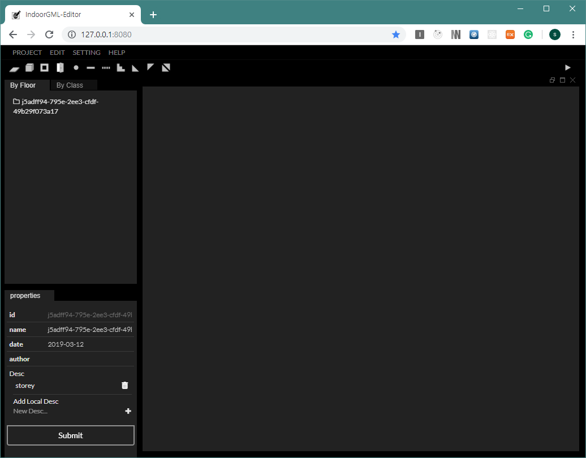
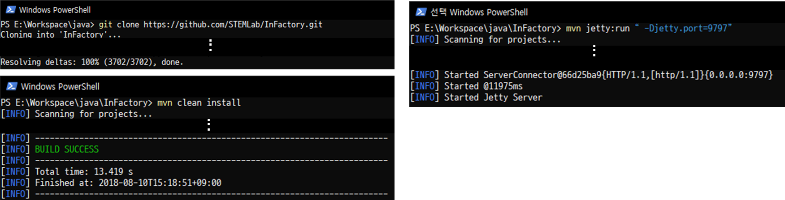
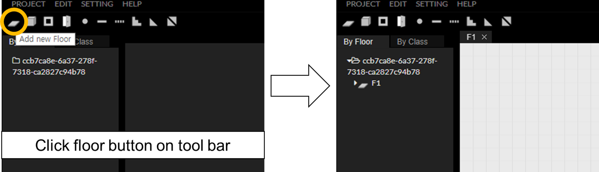
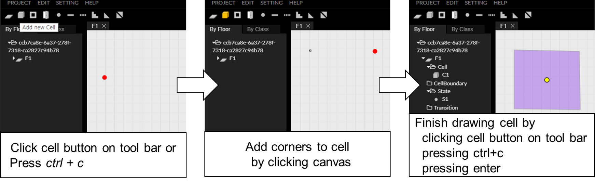
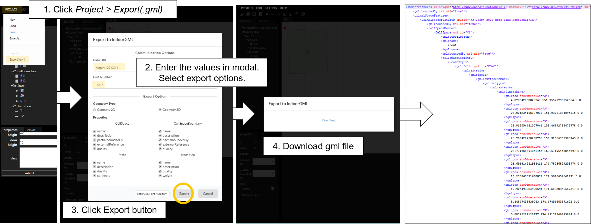
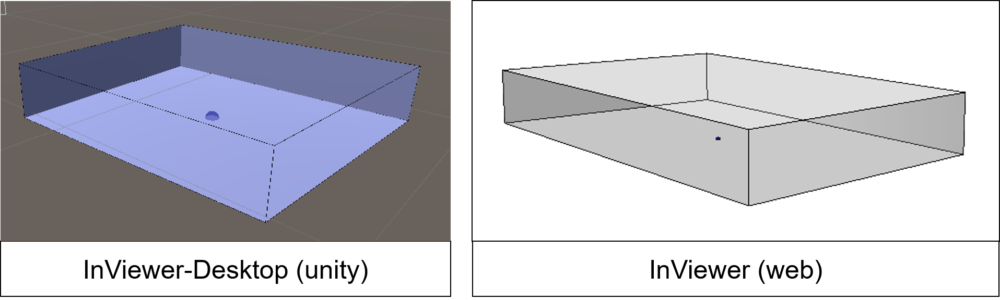

IndoorGML-Editor
=============

IndoorGML-Editor is an open source Javascript program that provides tools for simple editing IndoorGML data. To create IndoorGML documents we use InFactory Restful API(https://github.com/STEMLab/InFactory).

## Getting Started
1. You need to install modules. Please follow step. `npm install`
2. Start server by executing `npm start` and launch a web browser and open the editor `http://127.0.0.1:8080`
</img>
3. In order to create IndoorGML documents, you must install [InFactory](https://github.com/STEMLab/InFactory) that a restful server and library to create OGC IndoorGML
   * Prerequisites
       - Maven : over 3.5 version.
       - Java : JDK over 1.8 version. JAVA 8 is not working at the upper version
   * Installing
                    </img>
       - Download project : You can download zip file from https://github.com/STEMLab/InFactory
            or down using git  git clone https://github.com/STEMLab/InFactory.git
       - Build Project : Open command prompt on project folder and build project by executing `mvn clean install`
       - Start API Server : Start server by executing `mvn jetty:run “-Djetty.port=9797”` 

## Quick Start
A simple example to create IndoorGML document include one cellspace.
1. Add a new floor. 
   </img>
2. Add a new cellspace. 
    </img>
3. Export to InFactory. 
    </img>
4. You can check downloaded document on [InViewer-Desktop](https://github.com/STEMLab/InViewer-Desktop)(unity) or [InViewer](https://github.com/STEMLab/InViewer)(web). 
    </img>

:point_right: For more information about usage, please see the [User Guide](https://github.com/STEMLab/InEditor/blob/master/Guide/UserGuide/Index.md)

## Extention
This project supports generating IndoorGML data for core module and following extensions.
  1. [Navigation Extension](http://schemas.opengis.net/indoorgml/1.0/indoorgmlnavi.xsd)
  2. [Non-Navigable Space Extension](http://www.indoorgml.net/extensions/indoorgmlnonnavispace.xsd)
  3. [Storey Extension](http://www.indoorgml.net/extensions/indoorgmlstoreyextension.xsd) → will be supported
  4. [POI Extension]() → will be supported

## License
This project is licensed under the MIT licenses. - see the [LICENSE](https://github.com/STEMLab/IndoorGML-Editor/blob/master/LICENSE) file for details
=======
