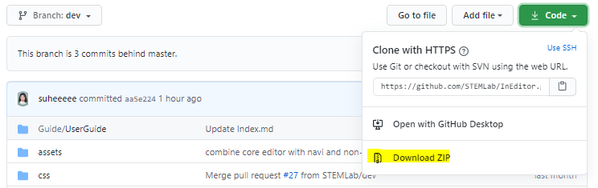

[![Contributors][contributors-shield]][contributors-url]
[![Forks][forks-shield]][forks-url]
[![Stargazers][stars-shield]][stars-url]
[![Issues][issues-shield]][issues-url]
[![MIT License][license-shield]][license-url]


<!-- PROJECT LOGO -->
<br />
<p align="center">
  <a>
    
  </a>

  <h2 align="center">IndoorGML Editor ~ InEditor</h2>

  <p align="center">
    A web-based editor for drawing and creating OGC IndoorGML data
    <br />
    <a href="http://indoorgml.net/">About IndoorGML</a>
    ·
    <a href="https://youtu.be/eW2Tpq2Yk_c">View Demo</a>
    ·
    <a href="https://github.com/STEMLab/InEditor/wiki">Wiki</a>
  </p>
</p>

<br />

IndoorGML-Editor is an open source Javascript program that provides tools for simple editing IndoorGML data. To create IndoorGML documents we use [InFactory Restful API](https://github.com/STEMLab/InFactory).

👉 Check more detail about IndoorGML-Editor [here](https://github.com/STEMLab/InEditor/wiki)

<br />

## Getting Started
### Prerequisites
1. OS : Windows recommaned. The exe file based on the Windows([val3dity](https://github.com/tudelft3d/val3dity.git)) is used for simple geometry validation.
2. Node.js : You need to install Node.js and set PATH
    * [link](https://nodejs.org/)
3. Maven : over 3.5 version. You need to install Maven and set MAVEN_HOME & PATH for InFactory
    * How to set MAVEN_HOME : [link for Window](https://www.mkyong.com/maven/how-to-install-maven-in-windows/) , [link for Linux](https://maven.apache.org/install.html)
    * If you do not want to install Maven, check Maven wrapper at [InFactroy](https://github.com/STEMLab/InFactory).
4. Java : JDK over 1.8 version. You need to install JDK and set JAVA_HOME & PATH.
    * **JAVA 8; not working at the upper version** 
    * How to set JAVA_HOME : [link](https://docs.oracle.com/cd/E19182-01/820-7851/inst_cli_jdk_javahome_t/)

### Installation
1. Clone or Download this repository.
    ```
    git clone https://github.com/STEMLab/InEditor.git
    ```
     </img>
2. Install NPM packages
    ```
    npm install
    ```
3. Start server
    ```
    npm start
    ```
4. Launch a web browser and open InEditor `http://127.0.0.1:5757`
</img>

5. In order to create IndoorGML documents, you must install **[InFactory](https://github.com/STEMLab/InFactory)** that a restful server and library to create OGC IndoorGML
    </img>
    1. Clone or Download this repository.
        * Download project : You can download zip file from https://github.com/STEMLab/InFactory
        * Clone
            ```
            git clone https://github.com/STEMLab/InFactory.git
            ```
    2. Build Project : Open command prompt on project folder and build project
        * If you install mavend and set PATH,
            ```
            mvn clean install
            ```
        * If not,
            ```
            ./mvnw clean install
            ```
    3. Start API Server : Start server
        * If you install mavend and set PATH,
            ```
            mvn jetty:run "-Djetty.port=9797"
            ```
        * If not,
            ```
            ./mvnw jetty:run "-Djetty.port=9797"
            ```

## Usage
A simple example to create IndoorGML document include one cellspace.
1. Add a new floor.<br>
   </img>
2. Add a new cellspace.<br>
    </img>
3. Export to InFactory.<br>
    </img>
4. You can check downloaded document on [InViewer-Desktop](https://github.com/STEMLab/InViewer-Desktop)(unity) or [InViewer](https://github.com/STEMLab/InViewer)(web).<br>
    </img>

👉 For more information about usage, check the [User Guide](https://github.com/STEMLab/InEditor/blob/master/Guide/UserGuide/Index.md) or [Wiki](https://github.com/STEMLab/InEditor/wiki/2-3.-Create-object)


## Extention
The project on master branch supports generating IndoorGML data for core module and following extensions.
  1. [Navigation Extension](http://schemas.opengis.net/indoorgml/1.0/indoorgmlnavi.xsd)
  2. [Non-Navigable Space Extension](http://www.indoorgml.net/extensions/indoorgmlnonnavispace.xsd)
  3. [Storey Extension](http://www.indoorgml.net/extensions/indoorgmlstoreyextension.xsd) → will be supported
  4. [POI Extension]() → will be supported

The editor for other extensions will be created in an additional branch.


## License
This project is licensed under the MIT licenses. - see the [LICENSE](https://github.com/STEMLab/IndoorGML-Editor/blob/master/LICENSE) file for details


<!-- MARKDOWN LINKS & IMAGES -->
[contributors-shield]: https://img.shields.io/github/contributors/STEMLab/InEditor.svg?style=flat-square
[contributors-url]: https://github.com/STEMLab/InEditor/graphs/contributors
[forks-shield]: https://img.shields.io/github/forks/STEMLab/InEditor.svg?style=flat-square
[forks-url]: https://github.com/STEMLab/InEditor/network/members
[stars-shield]: https://img.shields.io/github/stars/STEMLab/InEditor.svg?style=flat-square
[stars-url]: https://github.com/STEMLab/InEditor/stargazers
[issues-shield]: https://img.shields.io/github/issues/STEMLab/InEditor.svg?style=flat-square
[issues-url]: https://github.com/STEMLab/InEditor/issues
[license-shield]: https://img.shields.io/github/license/STEMLab/InEditor.svg?style=flat-square
[license-url]: https://github.com/STEMLab/InEditor/blob/master/LICENSE.txt
